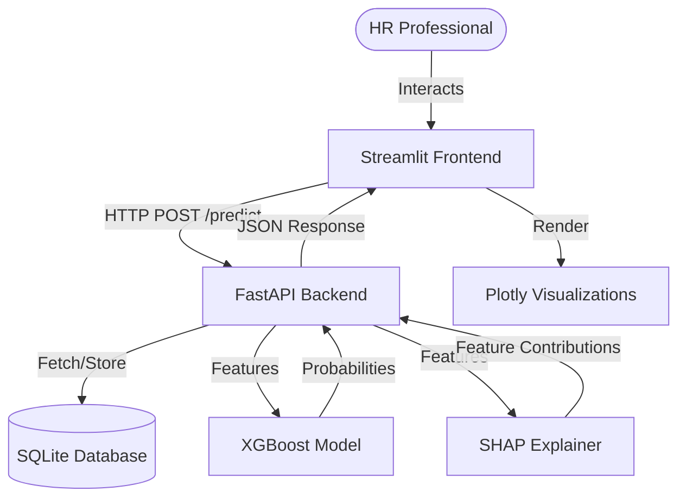
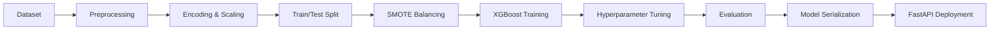
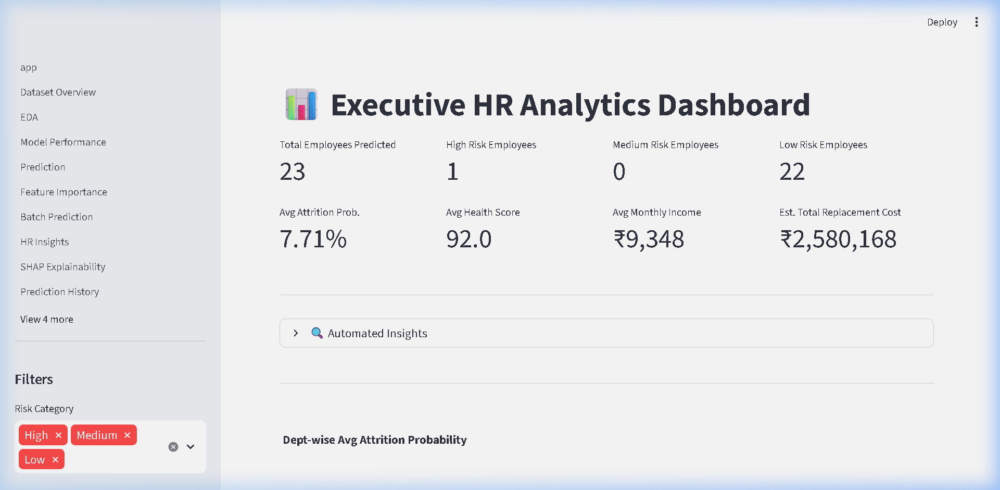
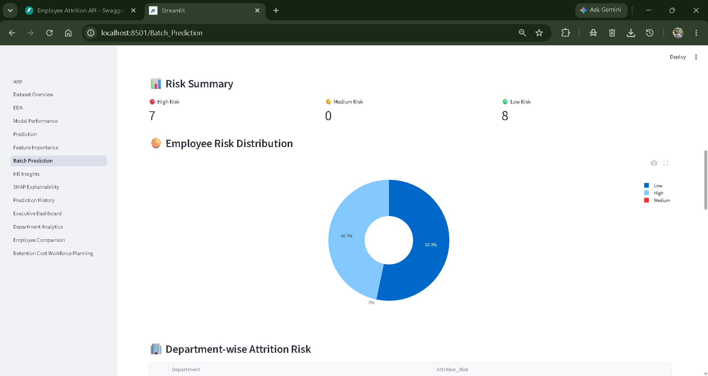

# Employee Attrition Prediction & HR Analytics Platform

> **Empowering HR teams with predictive insights and explainable AI to proactively manage workforce retention.**


---

## 📑 Table of Contents

- [📖 Overview](#-overview)
- [✨ Key Features](#-key-features)
- [🛠️ Tech Stack](#️-tech-stack)
- [🏗️ System Architecture](#️-system-architecture)
- [📁 Project Structure](#-project-structure)
- [⚙️ Machine Learning Pipeline](#️-machine-learning-pipeline)
- [🧠 Explainable AI (SHAP)](#-explainable-ai-shap)
- [🖥️ Dashboard Pages](#️-dashboard-pages)
- [🔌 API Endpoints](#-api-endpoints)
- [Environment Variables](#environment-variables)
- [🚀 Installation & Setup](#-installation--setup)
- [🏃‍♂️ Running the Project](#️-running-the-project)
- [🐳 Docker Deployment](#-docker-deployment)
- [📸 Screenshots](#-screenshots)
- [💼 Business Impact](#-business-impact)
- [🔮 Future Improvements](#-future-improvements)
- [👨‍💻 Author](#-author)
- [📄 License](#-license)

---

## 📖 Overview

Employee attrition is a critical challenge for modern organizations, often leading to significant financial costs, loss of institutional knowledge, and decreased team morale. 

This **Employee Attrition Prediction Platform** is a full-stack, end-to-end Machine Learning solution designed to help HR teams proactively identify employees at high risk of leaving. By leveraging an XGBoost predictive model combined with SHAP (Explainable AI), the platform not only predicts *who* is likely to leave but also explains *why*.

With interactive dashboards, what-if simulators, and department-wide analytics, this application translates raw HR data into actionable business intelligence, ultimately enabling organizations to design targeted retention strategies and save significant replacement costs.

---

## ✨ Key Features

- 🔮 **Single Employee Prediction**: Instantly predict the attrition risk for an individual employee with a comprehensive HR risk assessment.
- 📂 **Batch Prediction**: Upload a CSV to generate predictions and recommendations for thousands of employees simultaneously.
- 🧠 **SHAP Explainability**: Peek inside the ML "black box" to understand the exact factors driving a specific employee's prediction.
- 🧪 **What-if Simulator**: Interactively tweak an employee's salary, overtime, or satisfaction levels to see how it dynamically affects their retention probability.
- 📊 **Department Analytics**: Analyze attrition trends, average risk scores, and total replacement liabilities across entire departments.
- 📈 **Executive Dashboard**: A high-level, birds-eye view of organizational health, total financial risk, and recent prediction histories.
- ⚖️ **Employee Comparison**: Side-by-side benchmarking of multiple employees to allocate limited retention budgets effectively.
- 🤖 **HR Insights**: Generate AI-driven insights and immediate action plans based on predictive outputs.
- 💾 **Prediction History**: A complete, exportable historical log of all assessments run through the platform.
- 📑 **PDF Reports**: Export professional, single-click PDF summaries of employee attrition risks for management meetings.
- ⚙️ **FastAPI Backend**: A highly decoupled, scalable, and robust REST API driving all ML inference.
- 📉 **Interactive Plotly Visualizations**: Beautiful, responsive, and dynamic charts for exploratory data analysis (EDA) and reporting.

---

## 🛠️ Tech Stack

| Layer | Technology |
| :--- | :--- |
| **Frontend** | Streamlit, Plotly Express |
| **Backend API** | FastAPI, Pydantic, Uvicorn |
| **Machine Learning** | Scikit-Learn, XGBoost, SMOTE |
| **Explainable AI** | SHAP (TreeExplainer) |
| **Database** | SQLite, SQLAlchemy |
| **Deployment** | Docker, Docker Compose |

---

## 🏗️ System Architecture



---

## 📁 Project Structure

```text
├── api/                       # FastAPI Backend
│   ├── core/                  # Configurations, Exception Handlers, Logger
│   ├── routes/                # API Endpoints (predict, simulate, analytics, reports)
│   ├── services/              # ML Inference and SHAP service wrappers
│   └── main.py                # FastAPI Application Entry Point
├── app/                       # Streamlit Frontend
│   ├── helpers/               # UI utility functions and components
│   ├── pages/                 # Individual Streamlit Dashboard pages
│   ├── app.py                 # Streamlit Entry Point (Navigation)
│   ├── api_client.py          # HTTP client for communicating with the Backend
│   └── database.py            # Local SQLite interactions for the frontend
├── data/                      # IBM HR Analytics Dataset
├── models/                    # Serialized XGBoost model, encoders, and feature lists
├── src/                       # Machine Learning Pipeline & Training Scripts
│   ├── preprocessing/         # Data cleaning and EDA scripts
│   ├── training/              # Model training, SMOTE balancing, hyperparameter tuning
│   └── evaluation/            # Model performance and SHAP analysis scripts
├── Dockerfile                 # Docker configuration
├── requirements.txt           # Python dependencies
└── README.md                  # Project Documentation
```

---

## ⚙️ Machine Learning Pipeline

The predictive engine was built using the IBM HR Analytics dataset and follows a rigorous ML lifecycle:



**Highlights**:
- **SMOTE** (Synthetic Minority Over-sampling Technique) was used to address class imbalance (attrition is typically a minority event).
- **Hyperparameter Tuning** via GridSearchCV ensures optimal model performance and generalization.

---

## 🧠 Explainable AI (SHAP)

Machine learning in HR requires trust and transparency. We integrated **SHAP (SHapley Additive exPlanations)** to ensure the model's decisions are 100% transparent.

Instead of just returning a "75% Risk" score, SHAP breaks down the prediction to show *exactly* how much factors like "OverTime", "Monthly Income", or "Job Satisfaction" contributed to that specific score. This empowers HR to take targeted actions rather than guessing.

---

## 🖥️ Dashboard Pages

1. **Dataset Overview**: A high-level view of the underlying HR training data.
2. **EDA**: Dynamic cross-filtering and correlation heatmaps of the workforce.
3. **Model Performance**: Technical metrics (Accuracy, F1, ROC-AUC) and confusion matrices of the XGBoost model.
4. **Prediction**: The core engine to predict risk for a single employee and generate PDF reports.
5. **Feature Importance**: Global insights into what drives attrition across the entire organization.
6. **Batch Prediction**: Upload CSVs for mass workforce risk evaluation.
7. **HR Insights**: AI-generated action plans based on predictive data.
8. **SHAP Explainability**: Beeswarm plots, dependence plots, and local waterfall charts for deep ML transparency.
9. **Prediction History**: A searchable, exportable log of all past predictions.
10. **Executive Dashboard**: C-suite overview of total financial risk, average department health, and trends.
11. **Department Analytics**: Granular metrics segregated by individual departments.
12. **Employee Comparison**: Side-by-side benchmarking of up to 3 employees.
13. **Retention Cost Workforce Planning**: Financial modeling calculating the ROI of retention strategies vs. replacement costs.

---

## 🔌 API Endpoints

The decoupled FastAPI backend exposes the following robust endpoints:

- `GET /api/v1/health`: Service health check.
- `POST /api/v1/predict`: Predict attrition risk for a single employee and generate recommendations.
- `POST /api/v1/simulate`: Run a "what-if" scenario returning the delta in attrition probability.
- `GET /api/v1/analytics/summary`: Aggregate risk statistics across all departments and system-wide KPIs.
- `GET /api/v1/reports/pdf`: Generate a downloadable PDF report summarizing current employee attrition risks.

---

## Environment Variables

The project uses environment variables for configuration. You can easily set these up by copying the provided example file.

Create the `.env` file from `.env.example`:

```bash
cp .env.example .env
```

Make sure to edit the `.env` file and fill in the necessary values before running the application.

---

## 🚀 Installation & Setup

### 1. Clone the repository
```bash
git clone https://github.com/yourusername/employee-attrition-platform.git
cd employee-attrition-platform
```

### 2. Create a Virtual Environment
```bash
python -m venv venv
source venv/bin/activate  # On Windows use: venv\Scripts\activate
```

### 3. Install Dependencies
```bash
pip install -r requirements.txt
```

---

## 🏃‍♂️ Running the Project

The platform requires both the backend (FastAPI) and the frontend (Streamlit) to be running simultaneously.

### Start the Backend (Terminal 1)
```bash
uvicorn api.main:app --reload --port 8000
```

### Start the Frontend (Terminal 2)
```bash
streamlit run app/app.py
```
*The application will be accessible at `http://localhost:8501`*

---

## 🐳 Docker Deployment

To run the entire stack effortlessly using Docker:

```bash
# Build the Docker image
docker build -t attrition-platform .

# Run the container (Maps Streamlit to 8501 and FastAPI to 8000)
docker run -p 8501:8501 -p 8000:8000 attrition-platform
```

---

## 📸 Screenshots

| Prediction Dashboard | SHAP Explainability |
| :---: | :---: |
|  |  |
| **Executive Overview** | **Batch Processing** |
|  |  |

*(Note: Replace placeholder image paths with actual screenshots)*

---

## 💼 Business Impact

By deploying this platform, HR Departments can:
- **Reduce Turnover Costs**: Identifying high-risk employees early allows for preventative retention measures, saving the standard 1.5x - 2x salary replacement cost per employee.
- **Data-Driven Interventions**: SHAP explanations remove the guesswork. If "Work Life Balance" is the primary driver of risk, HR can offer flexible hours rather than an unnecessary salary hike.
- **Strategic Workforce Planning**: Executive and department-level analytics allow leadership to identify systemic toxic environments or management issues before mass exoduses occur.

---

## 🔮 Future Improvements

- **Integration with HRIS Systems**: Direct API connections to Workday, BambooHR, or SAP SuccessFactors for automated daily data syncing.
- **Time-Series Forecasting**: Predicting *when* an employee is likely to leave (e.g., within 3 months vs. 12 months).
- **Automated Retraining Pipeline**: Implementing Airflow or Prefect to automatically retrain the XGBoost model as new quarterly HR data flows into the system.

---

## 👨‍💻 Author

**Bankapalli Yashwanth**

🎓 B.Tech Computer Science & Engineering (AI/ML Enthusiast)

📧 Email: bankapallyashwanth03@gmail.com

💼 LinkedIn:
https://www.linkedin.com/in/yashwanth-bankapalli-475838263

🐙 GitHub:
https://github.com/yashwanth15-15

### Connect With Me

[](https://github.com/yashwanth15-15)
[](https://www.linkedin.com/in/yashwanth-bankapalli-475838263)
[](mailto:bankapallyashwanth03@gmail.com)

---

## 📄 License

This project is licensed under the **MIT License**. See the [LICENSE](LICENSE) file for more details.
