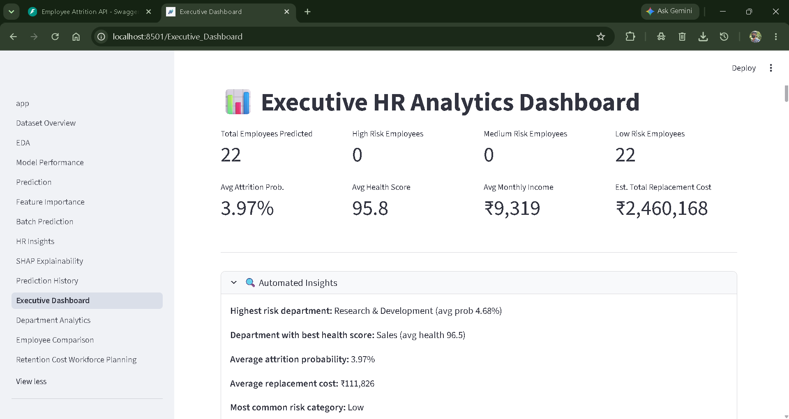
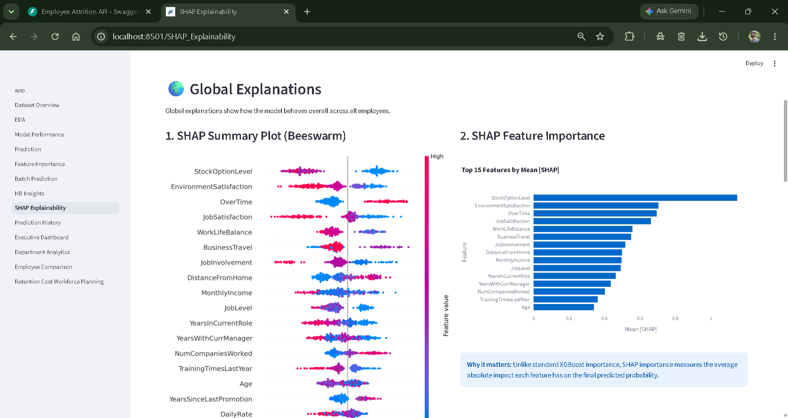
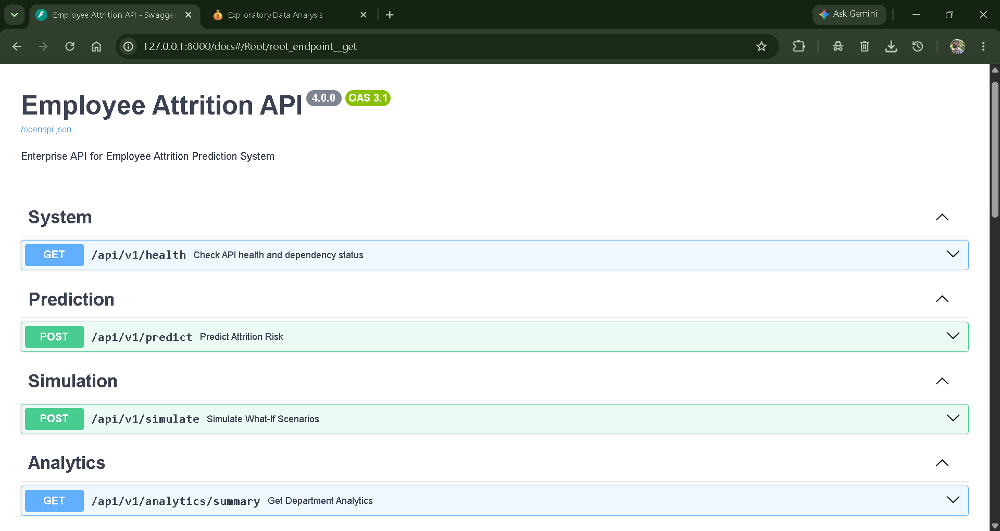

# Application Screenshots

A visual overview of the Employee Attrition Prediction & HR Analytics Platform.

*(Note: These screenshots represent the final Phase 4 Enterprise UI.)*

### 1. Executive Dashboard
*High-level overview of total predictions, risk distribution, and demographic breakdowns.*

### 2. Individual Employee Prediction
*Detailed profile analysis showing real-time probability, risk categorization, and AI-generated HR recommendations.*

### 3. SHAP Explainability & Top Risk Drivers
*Transparent breakdown of exactly which factors are pushing the employee toward attrition.*

### 4. Department Analytics
*Aggregated risk metrics organized by department to help executives identify toxic team environments.*

### 5. Employee Comparison
*Side-by-side benchmarking of two employees utilizing radar charts and differential metrics.*

### 6. Workforce Cost Planning
*Financial dashboard estimating the bottom-line cost of attrition and calculating the ROI of retention programs.*

### 7. FastAPI Swagger Documentation
*Interactive, auto-generated API documentation exposing the modular backend architecture.*

